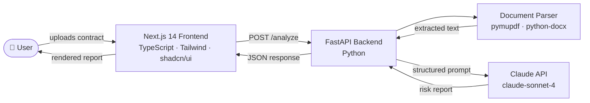

# Contract Analyser

**An AI-powered contract risk analysis tool that helps freelancers and small business owners understand what they're signing — in plain language, before it's too late.**

> 🚧 Currently in active development — the AI prompt layer is working end-to-end; the web interface is being built.

---

## 🎯 The Problem

Most people sign contracts they don't fully understand.

Not because they're careless — but because legal language is designed for lawyers, not for the people actually signing. A freelance designer, a small business owner, a first-time employee: they're the ones most exposed to unfair terms, and the least equipped to catch them.

Hiring a lawyer every time you sign a service contract isn't realistic. So most people either skip the fine print entirely, or spend hours Googling clauses and still walk away unsure.

I built this tool to close that gap.

---

## 💡 What It Does

Contract Analyser is an AI agent that reads a contract and tells you, in plain language:

- **What you're agreeing to** — a plain-language summary of your obligations, timeline, and key terms
- **Where the risks are** — a scored risk dashboard across 8 dimensions (payment terms, IP ownership, termination clauses, liability caps, etc.)
- **What could go wrong** — scenario walkthroughs for situations like non-payment, force majeure, or the other party going bankrupt
- **What to do about it** — auto-generated alternative clauses you can bring to the negotiation table
- **What to ask before signing** — a prioritised checklist of must-change, should-add, and confirm-before-signing items

After the report is generated, users can have a multi-turn conversation with the agent — asking follow-up questions with full context retained, without re-uploading anything.

---

## 🧠 Product Thinking

Building a contract chatbot is easy. Building one that's actually useful is not.

The challenge isn't getting an AI to summarise text. It's knowing **what matters to a non-lawyer user**, structuring the output so it's **actionable not just informative**, and calibrating the tone so it's **clear without being alarmist**.

### Key product decisions

**Framing everything from the vendor's (乙方) perspective, not neutral.**
Most legal tools try to be balanced. But the people who need this tool are almost always the weaker party in a contract negotiation. A neutral analysis isn't actually helpful to them — they need to know what's stacked against them, specifically.

**Separating "what it says" from "what it means" from "what you should do."**
These are three different things, and conflating them is why most AI-generated legal summaries feel useless. I structured the output to address each one explicitly.

**Building in scenario walkthroughs instead of just flagging risks.**
Knowing a clause is "high risk" doesn't help you. Knowing "if your client files for bankruptcy mid-project, here's what this clause means for you and here's what you can do" — that's actually useful.

**Deciding what not to build.**
The tool explicitly does not draft contracts from scratch, does not store user documents, and does not position itself as a legal opinion. These aren't missing features — they're deliberate product decisions that define the trust boundary of the tool.

### Principles I learned building this

**Good AI products are mostly about prompt architecture, not AI capability.**
The underlying model is capable of analysing any contract. The hard work was designing the output structure so it's consistent, useful, and doesn't overwhelm a non-expert user. This is a product problem, not a technical one.

**The user's real job is to walk into a negotiation prepared.**
I initially thought the product was about "understanding contracts." It's not. The actual job-to-be-done is: "I have a meeting with this client next Tuesday, and I need to know what to push back on." Everything in the output structure is oriented around that moment.

**Constraints create trust.**
Adding the disclaimer — "this is not legal advice, consult a lawyer for large contracts" — was a deliberate product decision, not just legal cover. A tool that acknowledges its limits is more trustworthy than one that claims to replace professional judgment. Users are more likely to rely on something that's honest about what it can't do.

---

## 📐 Current Status

This is a product at the design + working-prototype stage. The AI layer is functional end-to-end; the web app is under active development.

### ✅ Completed

- User research and problem definition
- Full Product Requirements Document covering all 6 feature modules
- AI system prompt — engineered, tested, and iterated across multiple contract types
- Technical architecture (Python + FastAPI backend, Next.js 14 frontend, Claude API)
- Feature prioritisation and product scope decisions
- Backend scaffold: FastAPI app, routers, Claude client service

### 🔨 In progress

- UI mockups (Figma)
- Frontend integration with the backend API
- Document upload + parsing pipeline (PDF, DOCX, plain text)
- Deployment to Vercel (frontend) + Railway (backend)

### What the working prototype already does

You can paste any contract into the AI prompt layer today and receive a structured risk report — scored dashboard, plain-language breakdown, scenario walkthroughs, and suggested clause rewrites. The remaining work is wrapping this in a proper web interface and shipping it.

---

## 🏗️ Architecture



**Why this split:** all LLM calls go through the backend — never directly from the browser. This keeps the API key server-side, lets us cache and rate-limit cleanly, and gives us a place to add document preprocessing and validation without touching the UI.

---

## 📁 Repository Structure

```
contract/
├── backend/                  # Python · FastAPI
│   ├── main.py               # FastAPI app entrypoint
│   ├── routers/              # API route handlers
│   ├── services/             # Claude client + business logic
│   ├── models/               # Pydantic schemas
│   └── requirements.txt
├── frontend/                 # Next.js 14 · TypeScript
│   ├── app/                  # App Router pages
│   ├── components/           # UI components (shadcn/ui)
│   └── lib/                  # API client + utilities
├── CLAUDE.md                 # Project rules for AI-assisted dev
└── README.md
```

## 📄 Documentation

- [Full Product Requirements Document](./docs/PRD.md) — user personas, feature prioritization, competitive landscape, risks & mitigations. Reflects my end-to-end product thinking on this project.
- [System Prompt](./prompts/system_prompt.md) — the engineered Claude prompt powering the risk analysis, with design rationale for each section.

---

## 🚀 Running Locally

```bash
# Backend (port 8000)
cd backend
python -m venv venv && source venv/bin/activate
pip install -r requirements.txt
cp .env.example .env   # then fill in ANTHROPIC_API_KEY
uvicorn main:app --reload

# Frontend (port 3000)
cd frontend
npm install
cp .env.local.example .env.local
npm run dev
```

---

## 🔮 Roadmap

If I had another month:

1. **Ship the web app** — get a URL anyone can use, with real contracts
2. **Run usability tests** — watch 5 freelancers use it on real contracts they're about to sign
3. **Instrument the follow-up questions** — the multi-turn conversation data would tell me exactly which parts of contracts are most confusing, which is a goldmine for improving the analysis structure
4. **Explore a B2B angle** — platforms that serve freelancers (agencies, talent marketplaces) might want this embedded as a value-add feature

---

## ⚠️ Disclaimer

This tool provides AI-generated analysis for informational purposes only. It is **not legal advice** and does not replace consultation with a qualified attorney. For contracts involving significant financial or legal exposure, please consult a lawyer. Analysis is calibrated for US law context only.

---

## 📧 About Me

Built by **Ruiyi (Alan) Yang** · April 2026

I'm a product person who codes — this project is part of a broader exploration into how AI changes what a single operator can build, and what product judgment looks like when the implementation constraint drops away.

If this is interesting to you, I'd love to hear from you.
